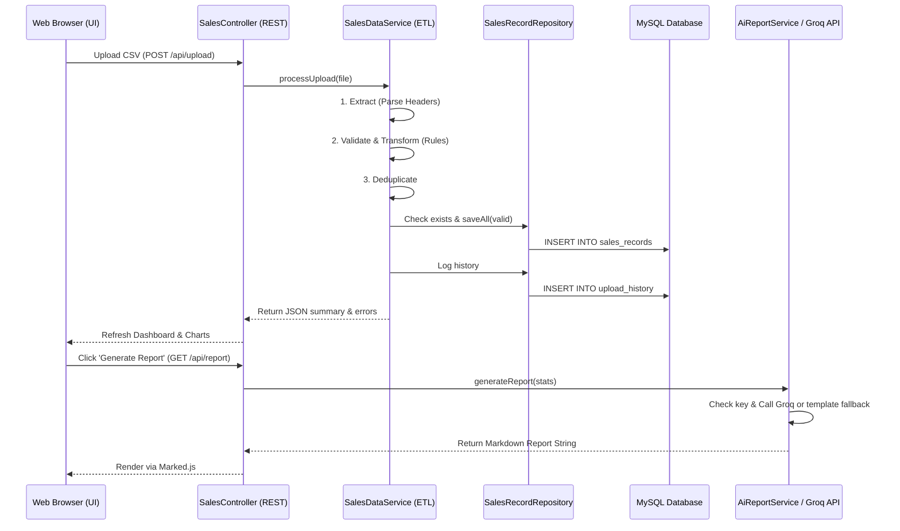
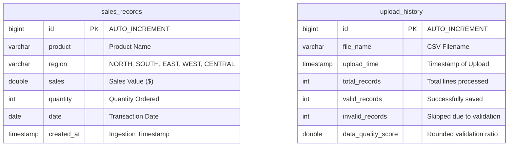

# AI-Powered Sales Data Quality & Reporting System | [link](https://ai-powered-sales-data-quality-reporting-b0vt.onrender.com/)

An industry-level Spring Boot web application designed for business analysts and sales operations teams (similar to systems used at consulting firms like Axtria). This portal allows users to upload raw sales CSV files, passes them through a structured **ETL (Extract-Transform-Load) Pipeline**, filters duplicates, runs data quality checks, displays real-time analytics dashboards, and compiles a professional AI-driven business report using the **Groq API**.

---

## 🚀 Key Features

1. **Sleek Consulting UI**: Responsive Bootstrap 5 interface featuring glassmorphic KPI cards, Chart.js visualizations, and dynamic tables.
2. **Automated ETL Ingestion**: Parses uploads, normalizes names, converts regions to uppercase, standardizes date parsing, and skips corrupted rows.
3. **Double-Sided Deduplication**: Filters identical rows within the current upload and prevents reloading of records already stored in MySQL.
4. **Data Quality scoring**: Computes a rounded Data Quality Score:
   $$\text{Data Quality Score} = \left(\frac{\text{Valid Records}}{\text{Total Processed Records}}\right) \times 100$$
5. **Detailed Error Logs**: Provides an on-screen table highlighting rows and specific fields skipped during ingestion.
6. **Smart AI Reporting**: Connects to the Groq API to compile an Executive Summary, Observations, Regional Breakdown, Business Risks, and Recommendations.
7. **Bullet-proof Ingestion Fallback**: Automatically falls back to a **Template-based report generation** engine if the API key is not configured or fails.
8. **Interactive Explorer**: Search database records by Product, Region, and Date Range with server-side pagination.
9. **CSV Exporting**: Downloads raw summary KPIs directly as a CSV spreadsheet.

---

## 🏗️ Project Architecture & Folder Structure

### Folder Structure
```
c:\Users\r9979\OneDrive\Desktop\AI_powered_sales_data_quality\
├── pom.xml
├── README.md
├── test-data/
│   ├── valid_sales.csv
│   └── invalid_sales.csv
└── src
    └── main
        ├── java
        │   └── com
        │       └── axtria
        │           └── salesdata
        │               ├── SalesDataApplication.java
        │               ├── controller
        │               │   ├── DashboardController.java  (HTML View Routes)
        │               │   └── SalesController.java      (REST Endpoints)
        │               ├── dto
        │               │   ├── DashboardStatsDto.java    (KPI Stats Carrier)
        │               │   ├── SalesRecordDto.java       (Raw Row Carrier)
        │               │   └── ValidationErrorDto.java   (Validation Errors)
        │               ├── entity
        │               │   ├── SalesRecord.java          (MySQL Table: sales_records)
        │               │   └── UploadHistory.java        (MySQL Table: upload_history)
        │               ├── exception
        │               │   └── GlobalExceptionHandler.java (Central Error Interceptor)
        │               ├── repository
        │               │   ├── SalesRecordRepository.java  (JPA Queries for sales)
        │               │   └── UploadHistoryRepository.java (JPA Queries for uploads)
        │               └── service
        │                   ├── SalesDataService.java     (ETL Engine & Calculations)
        │                   └── AiReportService.java      (Groq REST Call & Fallbacks)
        └── resources
            ├── application.properties
            ├── templates
            │   └── dashboard.html                         (Thymeleaf View Page)
            └── static
                ├── css
                │   └── main.css                          (Modern Consulting Styles)
                └── js
                    └── dashboard.js                       (AJAX, Chart.js, Marked.js)
```

---

## 🔄 Request Flow & ETL Workflow

### Request Flow


### ETL Workflow Details
1. **Extract**: Reads CSV input stream using `CSVParser` (Apache Commons CSV). Validates headers case-insensitively. Throws `"Invalid CSV Template"` if columns don't match.
2. **Transform**:
   - **Trim spaces**: Removes leading and trailing spaces from all values.
   - **Collapse spaces**: Replaces multiple spaces in product names with a single space.
   - **Uppercase Region**: Standardizes regions (e.g. `north` $\rightarrow$ `NORTH`).
   - **Date Standardization**: Parses input using multiple formatters (e.g., `yyyy-MM-dd`, `MM/dd/yyyy`) into a uniform `LocalDate` object.
   - **Validation Rules**: Ensures Sales $\ge 0$, Quantity $\ge 0$, fields are not empty, and dates are valid.
3. **Deduplicate**:
   - Skips duplicate lines within the current uploaded file.
   - Queries database via `existsBy...` to prevent reloading of identical transactions.
4. **Load**: Inserts valid transformed rows to the MySQL database in a single transaction. Writes upload history and saves the rounded `Data Quality Score`.

---

## 🗄️ Database Schema

### ER Diagram


---

## 🔌 API Documentation

| Method | Endpoint | Description | Query Parameters | Response Format |
| :--- | :--- | :--- | :--- | :--- |
| **POST** | `/api/upload` | Processes uploaded CSV through ETL pipeline | `file` (Multipart file) | JSON (Valid/Invalid counts, error list) |
| **GET** | `/api/dashboard/stats` | Retrieves core KPI metrics | None | JSON (`totalSales`, `averageSales`, etc.) |
| **GET** | `/api/analytics/region` | Retrieves sales metrics aggregated by region | None | JSON Array (`[{"region": "NORTH", "totalSales": 5000}]`) |
| **GET** | `/api/analytics/product` | Retrieves top 5 and bottom 5 product revenue | None | JSON (`{"top": [...], "bottom": [...]}`) |
| **GET** | `/api/upload-history` | Retrieves logs of last 10 file upload events | None | JSON Array (Upload histories) |
| **GET** | `/api/search` | Performs paginated, filtered record explorer | `product`, `region`, `dateFrom`, `dateTo`, `page`, `size` | JSON Page Object (Spring Data Page) |
| **GET** | `/api/report` | Generates AI Report (or template fallback) | None | JSON (`{"report": "# Markdown report..."}`) |
| **GET** | `/api/export` | Downloads dashboard summary metrics as CSV | None | CSV File attachment |
| **POST** | `/api/reset` | Deletes all records from MySQL (development helper) | None | JSON (`{"message": "System reset successfully"}`) |

---

## 💻 How to Run the Project

### Prerequisites
1. **Java Runtime**: JDK 21 or 25 installed and configured on the system.
2. **MySQL Server**: Installed and running on port 3306.
3. **Database Setup**: Create a schema named `sales_db` or let the app automatically create it via the connection parameter:
   `jdbc:mysql://localhost:3306/sales_db?createDatabaseIfNotExist=true`

### Configuration
Open [src/main/resources/application.properties](file:///c:/Users/r9979/OneDrive/Desktop/AI_powered_sales_data_quality/src/main/resources/application.properties) and update the credentials:
```properties
spring.datasource.username=root
spring.datasource.password=root

# To activate Groq AI, insert your API key here (otherwise template-based fallback runs)
groq.api.key=gsk_your_actual_groq_api_key
```

### Run Commands
1. Compile the code:
   ```cmd
   & "C:\Users\r9979\Downloads\maven-mvnd-1.0.6-windows-amd64\maven-mvnd-1.0.6-windows-amd64\mvn\bin\mvn.cmd" compile
   ```
2. Start the Spring Boot application:
   ```cmd
   & "C:\Users\r9979\Downloads\maven-mvnd-1.0.6-windows-amd64\maven-mvnd-1.0.6-windows-amd64\mvn\bin\mvn.cmd" spring-boot:run
   ```
3. Open your browser and navigate to:
   `http://localhost:8080`

---

## 🛠️ Technology Choices Rationale

1. **Spring Boot (Java 21)**: Ideal for rapid enterprise backend construction. Provides out-of-the-box support for REST APIs, static resources, and dependency injection, avoiding boilerplate XML configurations.
2. **Spring Data JPA**: Eliminates writing tedious SQL queries. Provides dynamic query derivation, automatic table generation, pagination support, and built-in transaction management.
3. **MySQL**: A robust, standard relational database suitable for transaction storage. Supports structured tables and handles grouping/aggregation queries efficiently.
4. **ETL Design Pattern**: Essential for analytics systems. Separating file ingestion into distinct Extract, Transform, and Load steps ensures the database is populated only with clean, normalized, non-duplicate records.
5. **Groq API**: Offers extremely fast inference speeds (using Llama 3 models), making it suitable for generating real-time business summaries.

---

