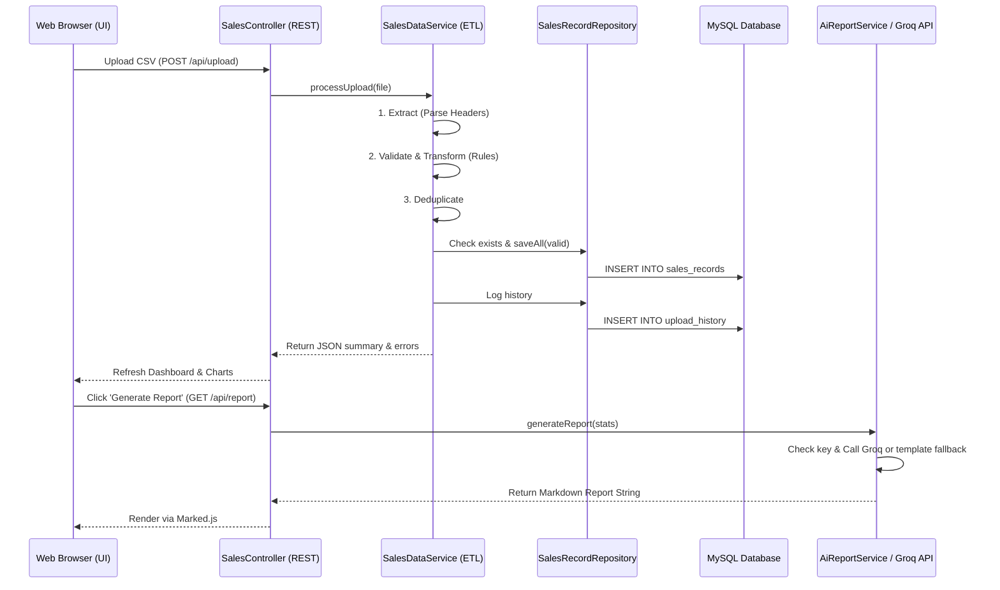
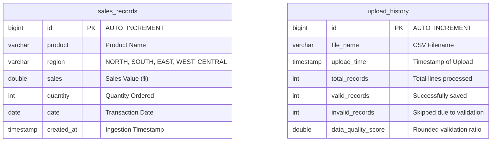

# AI-Powered Sales Data Quality & Reporting System

An industry-level Spring Boot web application designed for business analysts and sales operations teams (similar to systems used at consulting firms like Axtria). This portal allows users to upload raw sales CSV files, passes them through a structured **ETL (Extract-Transform-Load) Pipeline**, filters duplicates, runs data quality checks, displays real-time analytics dashboards, and compiles a professional AI-driven business report using the **Groq API**.

---

## 🚀 Key Features

1. **Sleek Consulting UI**: Responsive Bootstrap 5 interface featuring glassmorphic KPI cards, Chart.js visualizations, and dynamic tables.
2. **Automated ETL Ingestion**: Parses uploads, normalizes names, converts regions to uppercase, standardizes date parsing, and skips corrupted rows.
3. **Double-Sided Deduplication**: Filters identical rows within the current upload and prevents reloading of records already stored in MySQL.
4. **Data Quality scoring**: Computes a rounded Data Quality Score:
   $$\text{Data Quality Score} = \left(\frac{\text{Valid Records}}{\text{Total Processed Records}}\right) \times 100$$
5. **Detailed Error Logs**: Provides an on-screen table highlighting rows and specific fields skipped during ingestion.
6. **Smart AI Reporting**: Connects to the Groq API to compile an Executive Summary, Observations, Regional Breakdown, Business Risks, and Recommendations.
7. **Bullet-proof Ingestion Fallback**: Automatically falls back to a **Template-based report generation** engine if the API key is not configured or fails.
8. **Interactive Explorer**: Search database records by Product, Region, and Date Range with server-side pagination.
9. **CSV Exporting**: Downloads raw summary KPIs directly as a CSV spreadsheet.

---

## 🏗️ Project Architecture & Folder Structure

### Folder Structure
```
c:\Users\r9979\OneDrive\Desktop\AI_powered_sales_data_quality\
├── pom.xml
├── README.md
├── test-data/
│   ├── valid_sales.csv
│   └── invalid_sales.csv
└── src
    └── main
        ├── java
        │   └── com
        │       └── axtria
        │           └── salesdata
        │               ├── SalesDataApplication.java
        │               ├── controller
        │               │   ├── DashboardController.java  (HTML View Routes)
        │               │   └── SalesController.java      (REST Endpoints)
        │               ├── dto
        │               │   ├── DashboardStatsDto.java    (KPI Stats Carrier)
        │               │   ├── SalesRecordDto.java       (Raw Row Carrier)
        │               │   └── ValidationErrorDto.java   (Validation Errors)
        │               ├── entity
        │               │   ├── SalesRecord.java          (MySQL Table: sales_records)
        │               │   └── UploadHistory.java        (MySQL Table: upload_history)
        │               ├── exception
        │               │   └── GlobalExceptionHandler.java (Central Error Interceptor)
        │               ├── repository
        │               │   ├── SalesRecordRepository.java  (JPA Queries for sales)
        │               │   └── UploadHistoryRepository.java (JPA Queries for uploads)
        │               └── service
        │                   ├── SalesDataService.java     (ETL Engine & Calculations)
        │                   └── AiReportService.java      (Groq REST Call & Fallbacks)
        └── resources
            ├── application.properties
            ├── templates
            │   └── dashboard.html                         (Thymeleaf View Page)
            └── static
                ├── css
                │   └── main.css                          (Modern Consulting Styles)
                └── js
                    └── dashboard.js                       (AJAX, Chart.js, Marked.js)
```

---

## 🔄 Request Flow & ETL Workflow

### Request Flow


### ETL Workflow Details
1. **Extract**: Reads CSV input stream using `CSVParser` (Apache Commons CSV). Validates headers case-insensitively. Throws `"Invalid CSV Template"` if columns don't match.
2. **Transform**:
   - **Trim spaces**: Removes leading and trailing spaces from all values.
   - **Collapse spaces**: Replaces multiple spaces in product names with a single space.
   - **Uppercase Region**: Standardizes regions (e.g. `north` $\rightarrow$ `NORTH`).
   - **Date Standardization**: Parses input using multiple formatters (e.g., `yyyy-MM-dd`, `MM/dd/yyyy`) into a uniform `LocalDate` object.
   - **Validation Rules**: Ensures Sales $\ge 0$, Quantity $\ge 0$, fields are not empty, and dates are valid.
3. **Deduplicate**:
   - Skips duplicate lines within the current uploaded file.
   - Queries database via `existsBy...` to prevent reloading of identical transactions.
4. **Load**: Inserts valid transformed rows to the MySQL database in a single transaction. Writes upload history and saves the rounded `Data Quality Score`.

---

## 🗄️ Database Schema

### ER Diagram


---

## 🔌 API Documentation

| Method | Endpoint | Description | Query Parameters | Response Format |
| :--- | :--- | :--- | :--- | :--- |
| **POST** | `/api/upload` | Processes uploaded CSV through ETL pipeline | `file` (Multipart file) | JSON (Valid/Invalid counts, error list) |
| **GET** | `/api/dashboard/stats` | Retrieves core KPI metrics | None | JSON (`totalSales`, `averageSales`, etc.) |
| **GET** | `/api/analytics/region` | Retrieves sales metrics aggregated by region | None | JSON Array (`[{"region": "NORTH", "totalSales": 5000}]`) |
| **GET** | `/api/analytics/product` | Retrieves top 5 and bottom 5 product revenue | None | JSON (`{"top": [...], "bottom": [...]}`) |
| **GET** | `/api/upload-history` | Retrieves logs of last 10 file upload events | None | JSON Array (Upload histories) |
| **GET** | `/api/search` | Performs paginated, filtered record explorer | `product`, `region`, `dateFrom`, `dateTo`, `page`, `size` | JSON Page Object (Spring Data Page) |
| **GET** | `/api/report` | Generates AI Report (or template fallback) | None | JSON (`{"report": "# Markdown report..."}`) |
| **GET** | `/api/export` | Downloads dashboard summary metrics as CSV | None | CSV File attachment |
| **POST** | `/api/reset` | Deletes all records from MySQL (development helper) | None | JSON (`{"message": "System reset successfully"}`) |

---

## 💻 How to Run the Project

### Prerequisites
1. **Java Runtime**: JDK 21 or 25 installed and configured on the system.
2. **MySQL Server**: Installed and running on port 3306.
3. **Database Setup**: Create a schema named `sales_db` or let the app automatically create it via the connection parameter:
   `jdbc:mysql://localhost:3306/sales_db?createDatabaseIfNotExist=true`

### Configuration
Open [src/main/resources/application.properties](file:///c:/Users/r9979/OneDrive/Desktop/AI_powered_sales_data_quality/src/main/resources/application.properties) and update the credentials:
```properties
spring.datasource.username=root
spring.datasource.password=root

# To activate Groq AI, insert your API key here (otherwise template-based fallback runs)
groq.api.key=gsk_your_actual_groq_api_key
```

### Run Commands
1. Compile the code:
   ```cmd
   & "C:\Users\r9979\Downloads\maven-mvnd-1.0.6-windows-amd64\maven-mvnd-1.0.6-windows-amd64\mvn\bin\mvn.cmd" compile
   ```
2. Start the Spring Boot application:
   ```cmd
   & "C:\Users\r9979\Downloads\maven-mvnd-1.0.6-windows-amd64\maven-mvnd-1.0.6-windows-amd64\mvn\bin\mvn.cmd" spring-boot:run
   ```
3. Open your browser and navigate to:
   `http://localhost:8080`

---

## 🛠️ Technology Choices Rationale

1. **Spring Boot (Java 21)**: Ideal for rapid enterprise backend construction. Provides out-of-the-box support for REST APIs, static resources, and dependency injection, avoiding boilerplate XML configurations.
2. **Spring Data JPA**: Eliminates writing tedious SQL queries. Provides dynamic query derivation, automatic table generation, pagination support, and built-in transaction management.
3. **MySQL**: A robust, standard relational database suitable for transaction storage. Supports structured tables and handles grouping/aggregation queries efficiently.
4. **ETL Design Pattern**: Essential for analytics systems. Separating file ingestion into distinct Extract, Transform, and Load steps ensures the database is populated only with clean, normalized, non-duplicate records.
5. **Groq API**: Offers extremely fast inference speeds (using Llama 3 models), making it suitable for generating real-time business summaries.

---

## 🎓 Interview Questions & Best Answers

### Q1: What is an ETL Pipeline and how did you implement it in this application?
* **Best Answer**: ETL stands for Extract, Transform, Load. In this project, when a user uploads a CSV file, the **Extract** phase parses the file stream using Apache Commons CSV and validates that the column headers exactly match the template. The **Transform** phase trims whitespace, collapses double spaces in product names, converts region names to UPPERCASE, parses date strings into `LocalDate`, checks validations (e.g. non-negative numeric fields), and filters out duplicate rows. Finally, the **Load** phase bulk-saves the clean, deduplicated entities into MySQL using JPA's `saveAll` inside a transaction.

### Q2: Why did you choose Java constructor injection over `@Autowired` field injection?
* **Best Answer**: Constructor injection is recommended for Spring applications because it makes dependencies explicit, enforces class immutability (by allowing fields to be declared `final`), and makes unit testing easier since we can instantiate classes using standard `new` constructors without needing a Spring container or mock runners.

### Q3: How does duplicate detection work in your application?
* **Best Answer**: We implement double-sided duplicate detection during CSV ingestion. First, we prevent duplicates *within the uploaded file itself* by generating a unique string key (`product|region|sales|quantity|date`) for each row and saving it in a `HashSet`. If a row's key is already in the set, we skip it. Second, we prevent duplicates *against records already stored in MySQL* by calling `existsByProductAndRegionAndSalesAndQuantityAndDate(...)` on the JPA repository before saving.

### Q4: How is the Data Quality Score calculated and stored?
* **Best Answer**: The Data Quality Score is calculated as `(Valid Records / Total Uploaded Records) * 100`, where total uploaded records represents the sum of valid and invalid rows (excluding duplicates). The score is rounded to two decimal places using `Math.round(score * 100.0) / 100.0` and saved in the `upload_history` table as a double, providing a historical record of file ingestion health.

### Q5: How did you implement the AI Report Fallback mechanism?
* **Best Answer**: In `AiReportService`, we read the Groq API key from `application.properties`. If the key is empty, matches the default placeholder, or if the HTTP REST call to Groq fails (e.g., due to network or rate limits), the code catches the exception and falls back to a **Template-based report generator**. This generator dynamically inserts the actual database statistics into a highly polished, professional business markdown template, ensuring the user gets a working business report under any condition.

### Q6: How does the server-side pagination for search work?
* **Best Answer**: In the repository, we use Spring Data's `Pageable` parameter inside our custom `@Query` method. The controller accepts `page` and `size` parameters and passes them as a `PageRequest` to `SalesDataService`. The repository returns a `Page<SalesRecord>` object, which contains the list of records for the current page along with pagination metadata (e.g., `totalPages`, `totalElements`). The frontend `dashboard.js` uses this metadata to construct dynamic page links.

### Q7: Why did you decide to remove Lombok from the final implementation?
* **Best Answer**: In modern development environments, local JDK versions can range up to JDK 25. Lombok relies on internal compiler APIs (`com.sun.tools.javac`) which change frequently, causing build failures on newer JDKs. To make this project highly portable and ensure it compiles out-of-the-box on any system (from JDK 21 to JDK 25), I replaced all Lombok annotations with standard Java getters, setters, constructors, and a manual builder pattern.

### Q8: What database indices would you add to optimize the search endpoint?
* **Best Answer**: Since users frequently filter search results by `product`, `region`, and date range, I would create a composite index on `(region, date)` and a single index on `product`. A composite index is highly efficient for compound queries, and indexing the `product` column speeds up the text matching operations.

### Q9: How did you prevent chart rendering glitches on the frontend when uploading new data?
* **Best Answer**: Chart.js attaches event listeners to canvas elements. If you create a new chart instance on a canvas that already has an active chart, hovering over the chart causes it to glitch and flicker between old and new data. To solve this, I declared global variables (`regionChartInstance`, `productChartInstance`) in `dashboard.js`. Before rendering a new chart, the script checks if an instance exists and destroys it using `.destroy()` first.

### Q10: What is the benefit of using `@CreationTimestamp` in the `SalesRecord` entity?
* **Best Answer**: `@CreationTimestamp` is a Hibernate annotation that automatically sets the field to the current system timestamp when the entity is first saved to the database. This guarantees that our `createdAt` column matches the exact time the record was loaded via the ETL process, without needing manual time setters in service code.

### Q11: How do you handle file upload size limit exceptions?
* **Best Answer**: In `GlobalExceptionHandler`, we catch `MaxUploadSizeExceededException`, which Spring Boot throws when an uploaded file exceeds the limits configured in `application.properties` (set to 10MB in our case). The handler captures this exception and returns a clean HTTP 413 Payload Too Large response with a clear message, which the frontend displays to the user.

### Q12: Why did you use `RestTemplate` instead of `WebClient` for the API calls?
* **Best Answer**: `RestTemplate` is Spring's classic, blocking HTTP client. Since our application is a standard blocking Web MVC app and does not use reactive Spring WebFlux, `RestTemplate` is the simplest, most straightforward choice. It keeps dependencies light, is easy to understand, and does not require importing reactive modules.

### Q13: What happens if a CSV file with empty lines or wrong headers is uploaded?
* **Best Answer**: If the headers do not match (Product, Region, Sales, Quantity, Date case-insensitive), `SalesDataService` throws an `IllegalArgumentException` with the message `"Invalid CSV Template"`. The `GlobalExceptionHandler` intercepts this and returns a 400 Bad Request. If the headers are correct but some rows contain empty fields, the parser processes the file, flags those specific rows, adds them to the validation errors list, and continues processing the rest of the file.

### Q14: How does Spring Data JPA know how to connect to MySQL?
* **Best Answer**: Spring Boot uses auto-configuration. It scans `application.properties` for properties prefixed with `spring.datasource.*`. It instantiates a HikariCP connection pool using the URL, username, password, and driver class name provided, and automatically configures the `EntityManagerFactory` for our JPA repositories.

### Q15: How did you design the DTO architecture to comply with the project restrictions?
* **Best Answer**: To avoid over-engineering the application and keep the class count low, I limited DTOs to three core classes: `DashboardStatsDto` (for overall KPIs), `SalesRecordDto` (for holding raw CSV strings), and `ValidationErrorDto` (for detailing ingestion skipped rows). Unrelated analytics lists (like region summaries) are queried as standard database arrays `List<Object[]>` and formatted as simple Java Map structures before returning, keeping our DTO package small and readable.

### Q16: How do you prevent SQL Injection in your search queries?
* **Best Answer**: We use Spring Data JPA repositories with JPQL query parameters (`:product`, `:region`, etc.). JPQL uses prepared statements internally, which separates the SQL structure from the user-provided data. The SQL parser compiles the query schema first, and parameters are bound afterward, making SQL Injection impossible.

### Q17: What is the purpose of `@Transactional` in the file upload service method?
* **Best Answer**: The `@Transactional` annotation ensures that the entire ETL load process occurs within a database transaction context. If saving records or writing upload history fails midway, the transaction commits a rollback, reversing all database writes. This prevents partial uploads and keeps database states consistent.

### Q18: How does Thymeleaf render the HTML file?
* **Best Answer**: Thymeleaf is a server-side template engine. When a request hits `/` or `/dashboard`, the `DashboardController` returns the view name `"dashboard"`. Spring's view resolver locates `dashboard.html` in `templates/`, parses any Thymeleaf attributes (like `th:href`), dynamically injects variables into the HTML document on the server, and sends the compiled static HTML string back to the client browser.

### Q19: How did you implement date format standardization?
* **Best Answer**: Different CSV files might write dates as `2026-07-11`, `07/11/2026`, or `11-07-2026`. In `SalesDataService`, I created a helper method that iterates through an array of common date patterns (e.g., `yyyy-MM-dd`, `M/d/yyyy`, `dd-MM-yyyy`). It attempts to parse the string using `LocalDate.parse` for each pattern. Once a pattern succeeds, it returns the parsed `LocalDate` object. If all patterns fail, it throws a validation exception for that row.

### Q20: If this application was deployed in production, what scaling improvements would you make?
* **Best Answer**: For a production environment with millions of rows:
  1. I would process CSV uploads asynchronously using Spring's `@Async` and return an immediate job ID to the user to avoid blocking HTTP threads.
  2. I would implement database pagination using indexes for all read queries.
  3. I would use bulk inserts via JdbcTemplate batch updates instead of JPA's `saveAll`, which performs individual insert queries for each entity.
  4. I would cache dashboard statistics using Redis to avoid querying MySQL for every page refresh.
